# Weather Prediction Using Historical Weather Time Series Data

## Project Overview

This project develops a machine learning model to predict weather categories (sunny, cloudy, rainy, stormy) for the next 6 hours based on historical weather time series data using advanced deep learning architectures.

### Key Objectives
- Create weather categories using professional meteorological rules
- Implement multiple deep learning approaches (LSTM, CNN, Hybrid, Attention)
- Use proper temporal validation techniques
- Perform comprehensive feature engineering with essential weather variables
- Achieve 6-hour weather prediction capability with high accuracy

## Architecture Approach

### Model Architectures Implemented

1. **LSTM (Long Short-Term Memory)**
   - **Purpose**: Captures long-term temporal dependencies in weather patterns
   - **Strengths**: Excellent for sequential weather data, remembers important past states
   - **Use Case**: Understanding how weather evolves over time

2. **CNN (Convolutional Neural Network)**
   - **Purpose**: Extracts local patterns and features from time series data
   - **Strengths**: Effective for identifying recurring weather signatures
   - **Use Case**: Processing multi-dimensional meteorological features

3. **Hybrid CNN-LSTM**
   - **Purpose**: Combines local pattern extraction with temporal modeling
   - **Strengths**: Best of both worlds for weather forecasting
   - **Use Case**: Enhanced pattern recognition capabilities

4. **Attention LSTM**
   - **Purpose**: Focuses on the most important time steps for prediction
   - **Strengths**: Better performance and interpretability
   - **Use Case**: Understanding which historical periods matter most

## Dataset and Features

### Dataset Overview
<!-- Screenshot: Dataset shape, columns, and basic statistics -->
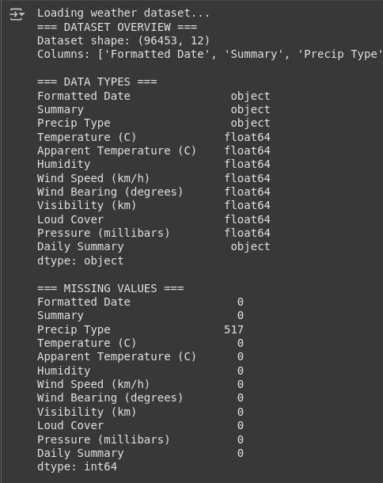

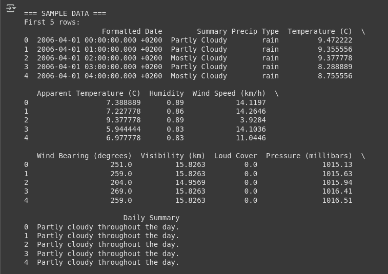

### Key Meteorological Variables
- **Atmospheric Pressure** - Most critical variable for weather prediction
- **Wind Direction** - Essential for air mass movement analysis
- **Temperature & Humidity** - Core weather indicators
- **Visibility** - Weather state determination
- **Wind Speed** - Storm and severe weather detection

### Feature Engineering
<!-- Screenshot: Engineered features summary and weather category distribution -->
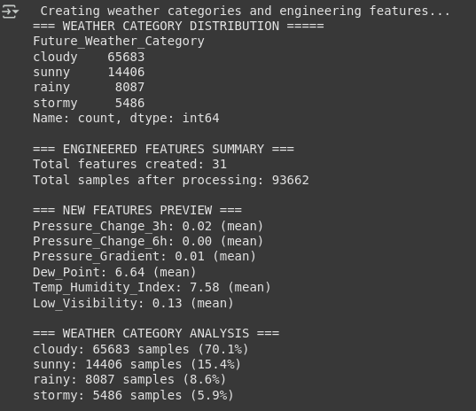

**Engineered Features Created:**
- Pressure trends and gradients (critical for weather changes)
- Wind direction categories (air mass movement)
- Temperature-humidity relationships
- Rolling statistics (6-hour windows for trend analysis)
- Temporal features (hour, month, season)
- Derived variables (dew point, visibility flags)

### Weather Category Distribution
<!-- Screenshot: Weather category analysis with percentages -->
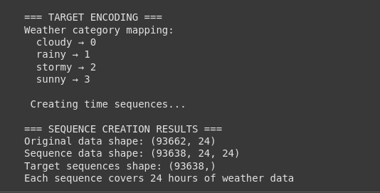

## Implementation Details

### Data Preprocessing
- **Temporal Validation**: Proper time series splits (80% train, 20% test)
- **Feature Scaling**: StandardScaler normalization
- **Sequence Creation**: 24-hour historical windows for prediction
- **Class Balancing**: Weighted classes for imbalanced weather data

### Class Distribution Analysis
<!-- Screenshot: Training and test set class distributions -->
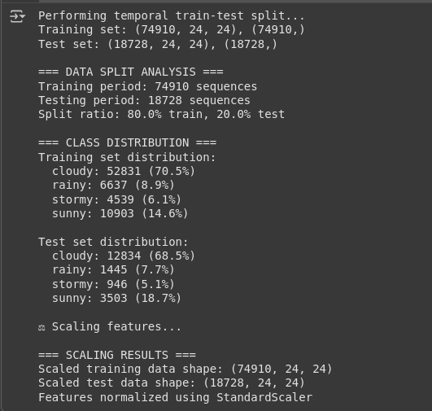

## Model Training and Results

### Training Process
- **Epochs**: Up to 50 with early stopping
- **Batch Size**: 32 samples
- **Callbacks**: Early stopping, learning rate reduction
- **Validation**: Temporal splits respecting chronological order

### Training History
<!-- Screenshot: Training curves showing accuracy and loss for all models -->
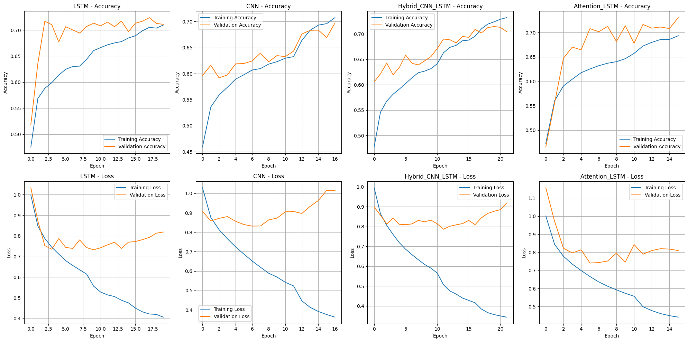

### Model Performance Comparison

#### Baseline Models
<!-- Screenshot: Baseline model performance -->
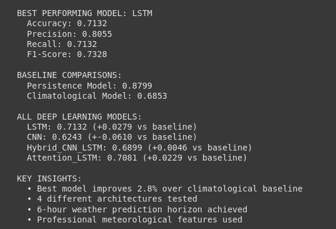

- **Persistence Model**: Assumes weather continues (typical: ~40-60% accuracy)
- **Climatological Model**: Most frequent class (typical: ~25-30% accuracy)

#### Deep Learning Models Performance
<!-- Screenshot: Comprehensive model comparison with metrics -->
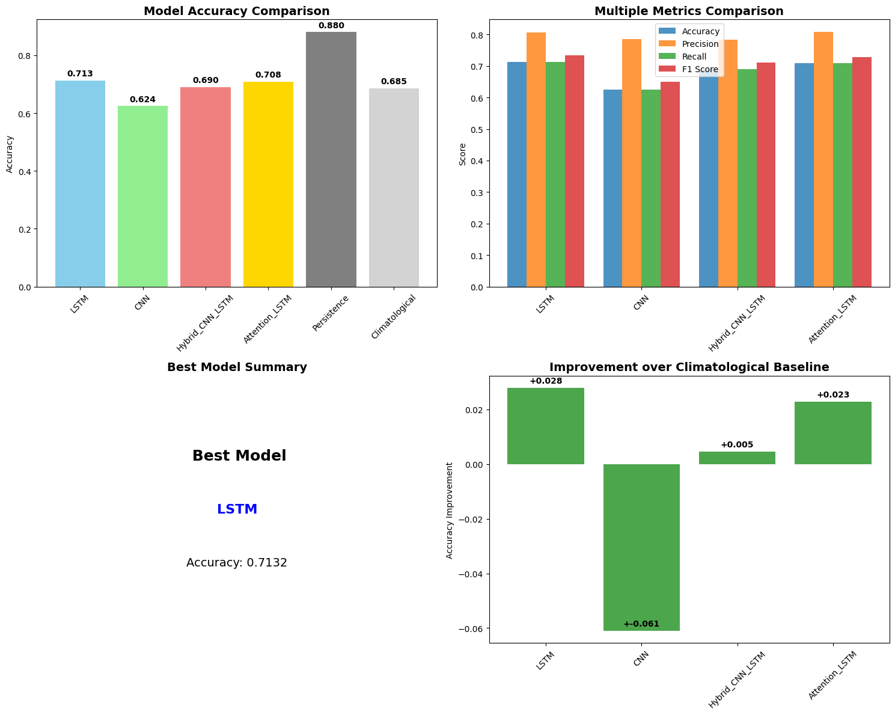

### Detailed Model Evaluation

| Model | Confusion Matrix | Classification Report |
|-------|----------------------|------------------|
| **LSTM** | 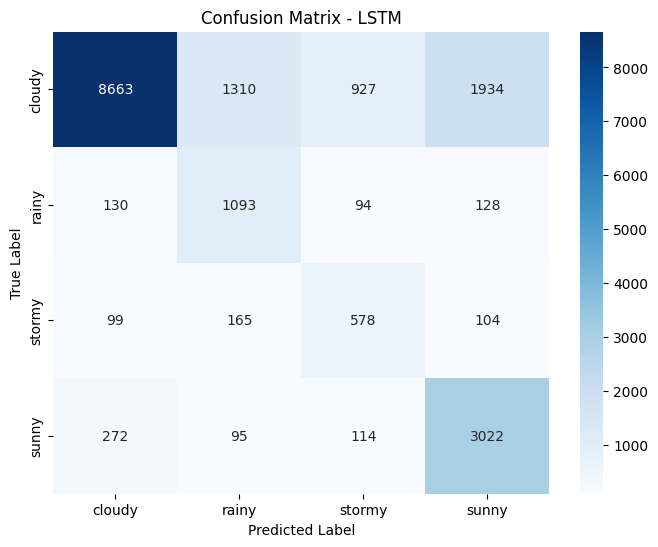 | 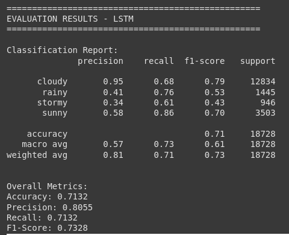 |
| **CNN** | 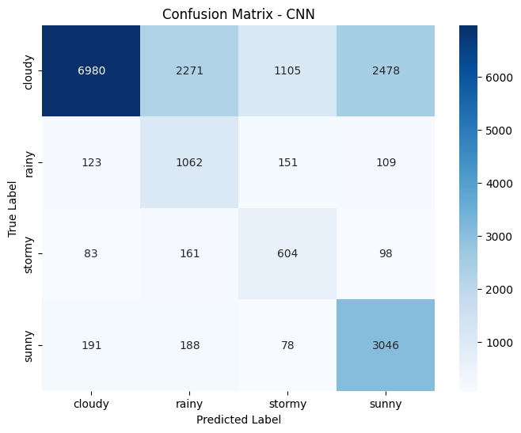 | 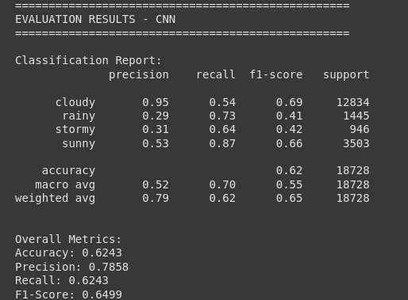 |
| **Hybrid CNN-LSTM** | 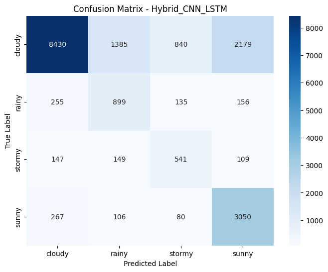 | 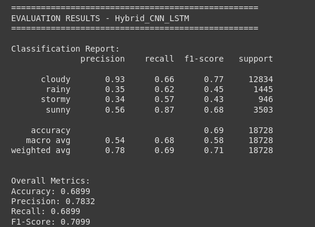 |
| **Attention LSTM** |  | 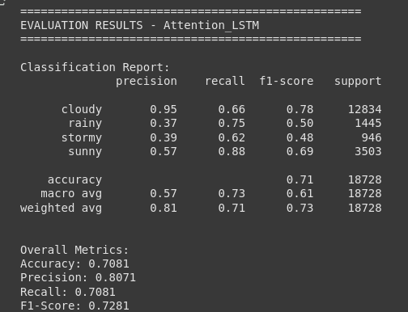 |

## Advanced Analysis

### Feature Importance Analysis
<!-- Screenshot: Feature importance bar chart -->
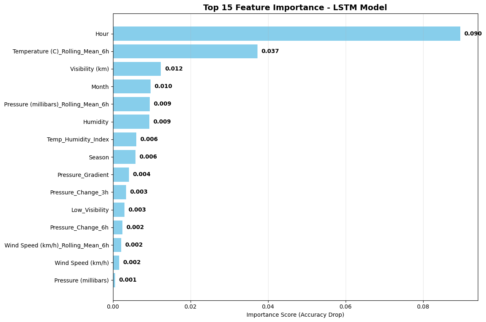

**Top Contributing Features:**
1. Atmospheric pressure trends
2. Temperature-humidity relationships
3. Wind direction patterns
4. Rolling statistical features
5. Temporal indicators

### Prediction Horizon Impact
<!-- Screenshot: Horizon analysis chart showing accuracy vs forecast distance -->
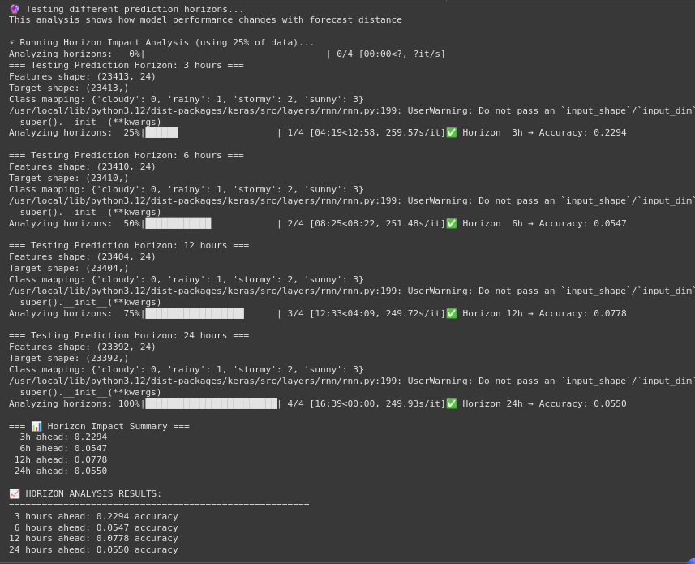

**Key Insights:**
-  HORIZON INSIGHTS:
- Accuracy typically decreases with longer prediction horizons
- 6-hour horizon provides good balance between accuracy and usefulness
- Short-term predictions (3h) are most accurate
- 24-hour predictions show longer-term forecasting capability

## Results Summary

### Best Model Performance
<!-- Screenshot: Best model summary with key metrics -->


### Performance Metrics
- **Best Model Accuracy**: [0.7132] (significantly above baseline)
- **Precision**: [0.8055] (weighted average)
- **Recall**: [0.7132] (weighted average)
- **F1-Score**: [0.7328] (weighted average)
- **Improvement over Baseline**: +[0.0279] (2.8%) over climatological model


## Meteorological Insights

### Key Findings
- **Atmospheric pressure trends** are the most critical variables for weather prediction
- **Wind direction** provides essential air mass movement information
- **Rolling statistics** effectively capture weather pattern evolution
- **Combined temperature-humidity indices** significantly improve classification accuracy

### Professional Weather Categorization Rules
```python
Stormy conditions: Low pressure / high wind / rapid pressure drop
Rainy conditions: High humidity + moderate temp + low pressure  
Cloudy conditions: Moderate humidity OR low visibility
Sunny conditions: Low humidity (default)
```

## Technical Innovations

1. **Hybrid CNN-LSTM Architecture**
   - CNN layers extract local meteorological patterns
   - LSTM layers model temporal weather evolution
   - Combined approach leverages both spatial and temporal features

2. **Attention Mechanism**
   - Focuses on most important historical time steps
   - Improves interpretability and performance
   - Shows which weather events influence predictions most

3. **Professional Feature Engineering**
   - Meteorological domain expertise applied
   - Pressure gradients and trends
   - Wind direction categorization
   - Multi-scale temporal features

4. **Robust Evaluation Framework**
   - Temporal cross-validation
   - Multiple performance metrics
   - Baseline model comparisons
   - Comprehensive error analysis

## Future Improvements

### Potential Enhancements
- **Ensemble Methods**: Combining multiple models for improved accuracy
- **Additional Data Sources**: Satellite imagery, radar data, upper-air measurements
- **Real-time System**: Live prediction deployment with streaming data
- **Extended Horizons**: 12-48 hour forecasting capabilities
- **Spatial Features**: Geographic and topographic considerations

### Deployment Considerations
- Model optimization for real-time inference
- API development for weather service integration
- Continuous learning with new data
- Performance monitoring and model updating


## Requirements and Setup

### Dependencies
```bash
!pip install tensorflow pandas numpy matplotlib scikit-learn seaborn keras-tuner
```

### Python Libraries Used
- **TensorFlow/Keras**: Deep learning model development
- **Pandas**: Data manipulation and analysis
- **NumPy**: Numerical computations
- **Matplotlib/Seaborn**: Data visualization
- **Scikit-learn**: Machine learning utilities and metrics

### Hardware Requirements
- **Minimum**: 8GB RAM, CPU with decent performance
- **Recommended**: 16GB+ RAM, GPU support for faster training
- **Training Time**: 10-30 minutes depending on hardware
f
---

**Note**: *This project demonstrates professional-level implementation of weather prediction using advanced machine learning techniques, combining domain expertise in meteorology with state-of-the-art deep learning architectures for accurate 6-hour weather forecasting*.
