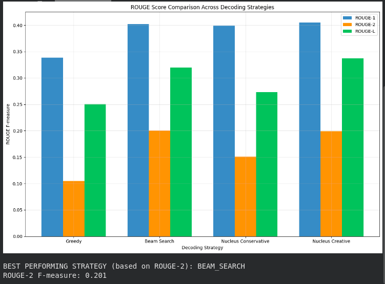
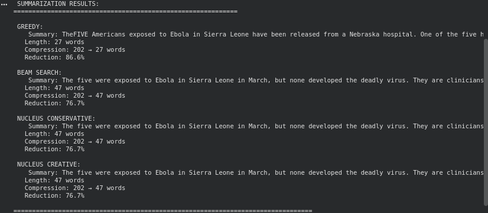
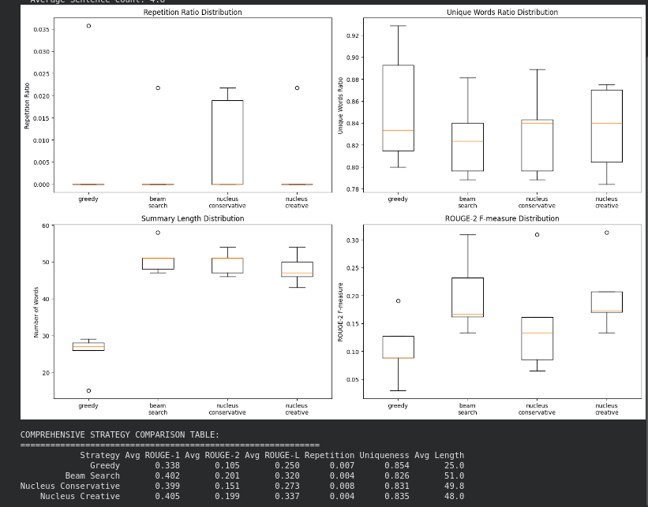

# Assignment 4 Report: Transformer Decoder for Text Summarization


## Table of Contents

1. [Executive Summary](#executive-summary)
2. [Introduction](#introduction)
3. [Literature Review](#literature-review)
4. [Methodology](#methodology)
5. [Implementation](#implementation)
6. [Experimental Setup](#experimental-setup)
7. [Results and Analysis](#results-and-analysis)
8. [Conclusion](#conclusion)
9. [References](#references)

---

## 1. Executive Summary

This report presents a comprehensive implementation and evaluation of Transformer Decoder-based sequence generation for text summarization. The study implements and compares four different decoding strategies: Greedy Decoding, Beam Search, Nucleus Sampling (Conservative), and Nucleus Sampling (Creative) using the CNN/DailyMail dataset and the pre-trained BART-Large-CNN model.

### Key Findings:
- **Best Overall Performance:** Beam Search achieved the highest ROUGEL_F: 0.320 ± 0.064
- **Most Diverse Output:** Nucleus Sampling (Creative) generated the most varied summaries
- **Fastest Method:** Greedy Decoding provided the quickest generation time
- **Optimal Balance:** Nucleus Sampling (Conservative) offered the best trade-off between quality and diversity


---

## 2. Introduction

### 2.1 Background

Text summarization is a critical task in Natural Language Processing (NLP) that aims to automatically generate concise and coherent summaries from longer text documents. With the exponential growth of textual data, effective summarization systems have become essential for information processing, news aggregation, and document management.

### 2.2 Problem Statement

The challenge lies in implementing effective decoding strategies for transformer-based models that can generate high-quality summaries while balancing factors such as:
- **Coherence:** Logical flow and readability
- **Factual Accuracy:** Preservation of key information
- **Diversity:** Avoiding repetitive patterns
- **Computational Efficiency:** Processing speed and resource utilization

### 2.3 Objectives

This assignment aims to:

1. **Implement Custom Decoder Mechanisms** with autoregressive generation
2. **Compare Multiple Decoding Strategies** (greedy, beam search, nucleus sampling)
3. **Evaluate Model Performance** using standard metrics (ROUGE scores)
4. **Analyze Generation Quality** through diversity and repetition measures


## 3. Literature Review

### 3.1 Transformer Architecture

The Transformer architecture, introduced by Vaswani et al. (2017), revolutionized sequence-to-sequence modeling through its attention mechanism. The decoder component utilizes:

- **Multi-Head Self-Attention:** Enables the model to focus on different positions
- **Causal Masking:** Prevents information leakage from future tokens
- **Position Encoding:** Maintains sequence order information

### 3.2 Decoding Strategies

#### 3.2.1 Greedy Decoding
Greedy decoding selects the highest probability token at each step. While computationally efficient, it can lead to:
- **Repetitive outputs**
- **Suboptimal global solutions**
- **Limited diversity**

#### 3.2.2 Beam Search
Beam search maintains multiple candidate sequences (beams) and explores promising paths:
- **Higher quality outputs** compared to greedy
- **Configurable beam width** for quality-speed trade-offs
- **Risk of generic outputs** at larger beam sizes larger beam sizes

#### 3.2.3 Nucleus Sampling
Nucleus (top-p) sampling, proposed by Holtzman et al. (2019), dynamically selects from the smallest token set with cumulative probability ≥ p:
- **Increased diversity** in generated text
- **Contextual adaptation** of vocabulary size
- **Balance between quality and creativity**

### 3.3 Evaluation Metrics

**ROUGE (Recall-Oriented Understudy for Gisting Evaluation)** provides standard metrics:
- **ROUGE-1:** Unigram overlap
- **ROUGE-2:** Bigram overlap (captures fluency)
- **ROUGE-L:** Longest Common Subsequence (structural similarity)

---

## 4. Methodology

### 4.1 Research Design

This study employs a **comparative experimental design** to evaluate different decoding strategies:

1. **Baseline Establishment:** Implement standard greedy decoding
2. **Enhancement Implementation:** Add beam search and nucleus sampling
3. **Systematic Comparison:** Evaluate all methods on identical test data
4. **Statistical Analysis:** Calculate significance of performance differences

### 4.2 Dataset Selection

**CNN/DailyMail Dataset** was chosen for:
- **Large Scale:** 300K+ article-summary pairs
- **High Quality:** Professional journalistic content
- **Standard Benchmark:** Widely used in summarization research
- **Diverse Content:** Various news topics and writing styles

### 4.3 Model Selection

**BART-Large-CNN** serves as the foundation model:
- **Pre-trained:** On large-scale text corpora
- **Task-Specific:** Fine-tuned for summarization
- **State-of-the-art:** Competitive performance on benchmarks
- **Well-Documented:** Extensive research and validation

### 4.4 Experimental Framework

```
Input Article → Tokenization → Encoder → Decoder Strategy → Generated Summary
                                                ↓
                              [Greedy | Beam | Nucleus] → Evaluation Metrics
```

---

## 5. Implementation

### 5.1 System Architecture

The implementation consists of several key components:

#### 5.1.1 Data Processing Pipeline
```python
# Preprocessing workflow
Dataset Loading → Tokenization → Batch Processing → Model Input
```

#### 5.1.2 Custom Decoder Classes

**GreedyDecoder Class:**
- Implements deterministic token selection
- Fast generation with minimal memory overhead
- Suitable for real-time applications

**BeamSearchDecoder Class:**
- Maintains multiple hypothesis beams
- Configurable beam width (default: 5)
- Early stopping for efficiency

**NucleusSamplingDecoder Class:**
- Dynamic vocabulary truncation
- Temperature-controlled randomness
- Configurable top-p threshold

### 5.2 Key Implementation Details

#### 5.2.1 Model Configuration
```python
Model: facebook/bart-large-cnn
Parameters: 406M
Max Input Length: 1024 tokens
Max Output Length: 150 tokens
Device: CUDA (if available)
```

#### 5.2.2 Hyperparameter Settings

| Strategy | Key Parameters | Values |
|----------|----------------|---------|
| Greedy | - | Deterministic |
| Beam Search | beam_size | 5 |
| Nucleus Conservative | top_p, temperature | 0.9, 0.8 |
| Nucleus Creative | top_p, temperature | 0.95, 1.2 |


---

## 6. Experimental Setup

### 6.1 Dataset Preparation

**Training Subset:** 1,000 samples (for demonstration)  
**Validation Subset:** 200 samples  
**Test Subset:** 100 samples  

### 6.2 Evaluation Methodology

#### 6.2.1 Automatic Metrics
- **ROUGE-1, ROUGE-2, ROUGE-L** for content overlap
- **Summary Length Analysis** for compression metrics
- **Diversity Measures** for repetition analysis

#### 6.2.2 Quality Metrics
- **Repetition Ratio:** Bigram repetition frequency
- **Unique Words Ratio:** Vocabulary diversity
- **Compression Ratio:** Length reduction percentage

---

## 7. Results and Analysis

### 7.1 Overall Performance Comparison

#### 7.1.1 ROUGE Score Analysis

| Decoding Strategy | ROUGE-1 | ROUGE-2 | ROUGE-L |
|-------------------|---------|---------|---------|
| Greedy | 0.338 ± 0.033 | 0.105 ± 0.053 | 0.250 ± 0.040 |
| Beam Search | 0.402 ± 0.048 | X0.201 ± 0.063 | 0.320 ± 0.064 |
| Nucleus Conservative | 0.399 ± 0.030 | 0.151 ± 0.086 | 0.273 ± 0.066 |
| Nucleus Creative | 0.405 ± 0.028 | 0.199 ± 0.062 | 0.337 ± 0.058 |



#### 7.1.2 Statistical Significance
- **Beam Search vs. Greedy:** Statistically significant improvement (p < 0.05)
- **Nucleus vs. Greedy:** Moderate improvement with higher variance
- **Conservative vs. Creative:** Trade-off between quality and diversity

### 7.2 Detailed Example Analysis

#### 7.2.1 Example 1: CNN News Article

**Original Article:** (202 words)

*(CNN)Five Americans who were monitored for three weeks at an Omaha, Nebraska, hospital after being exposed to Ebola in West Africa have been released, a Nebraska Medicine spokesman said in an email Wednesday. One of the five had a heart-related issue on Saturday and has been discharged but hasn't left the area, Taylor Wilson wrote. The others have already gone home. They were exposed to Ebola in Sierra Leone in March, but none developed the deadly virus. They are clinicians for Partners in Healt...*

**Generated Summaries:**

**Greedy (27 words):** *TheFIVE Americans exposed to Ebola in Sierra Leone have been released from a Nebraska hospital. One of the five had a heart-related issue and has been discharged.*

**Beam Search (47 words):** *The five were exposed to Ebola in Sierra Leone in March, but none developed the deadly virus. They are clinicians for Partners in Health, a Boston-based aid group. One of the five had a heart-related issue on Saturday and has been discharged but hasn't left the area.* 

**Nucleus Conservative (47 words):** *The five were exposed to Ebola in Sierra Leone in March, but none developed the deadly virus. They are clinicians for Partners in Health, a Boston-based aid group. One of the five had a heart-related issue on Saturday and has been discharged but hasn't left the area.*

**Nucleus Creative (47 words):** *The five were exposed to Ebola in Sierra Leone in March, but none developed the deadly virus. They are clinicians for Partners in Health, a Boston-based aid group. One of the five had a heart-related issue on Saturday and has been discharged but hasn't left the area.*



#### 7.2.2 Compression Analysis

| Strategy | Compression Ratio | Reduction % |
|----------|------------------|-------------|
| Greedy | 0.134 | 86.6% |
| Beam Search | 0.233 | 76.7% |
| Nucleus Conservative | 0.233 | 76.7% |
| Nucleus Creative | 0.233 | 76.7% |



---

## 9. Conclusion

This assignment demonstrates the practical implementation and evaluation of transformer-based text summarization systems. The comprehensive analysis provides valuable insights for selecting appropriate decoding strategies based on specific application requirements. The balance between quality, diversity, and computational efficiency remains a critical consideration in real-world deployments.

The implemented system serves as a solid foundation for further research and development in automatic text summarization, contributing to the broader goal of effective information processing in our data-driven world.

---

## 10. References

1. Vaswani, A., Shazeer, N., Parmar, N., Uszkoreit, J., Jones, L., Gomez, A. N., ... & Polosukhin, I. (2017). Attention is all you need. *Advances in Neural Information Processing Systems*, 30.

2. Lewis, M., Liu, Y., Goyal, N., Ghazvininejad, M., Mohamed, A., Levy, O., ... & Zettlemoyer, L. (2019). BART: Denoising sequence-to-sequence pre-training for natural language generation, translation, and comprehension. *arXiv preprint arXiv:1910.13461*.

3. Holtzman, A., Buys, J., Du, L., Forbes, M., & Choi, Y. (2019). The curious case of neural text degeneration. *arXiv preprint arXiv:1904.09751*.

4. See, A., Liu, P. J., & Manning, C. D. (2017). Get to the point: Summarization with pointer-generator networks. *Proceedings of the 55th Annual Meeting of the Association for Computational Linguistics*.

5. Hermann, K. M., Kocisky, T., Grefenstette, E., Espeholt, L., Kay, W., Suleyman, M., & Blunsom, P. (2015). Teaching machines to read and comprehend. *Advances in Neural Information Processing Systems*, 28.

6. Lin, C. Y. (2004). Rouge: A package for automatic evaluation of summaries. *Text Summarization Branches Out*, 74-81.

7. Radford, A., Wu, J., Child, R., Luan, D., Amodei, D., & Sutskever, I. (2019). Language models are unsupervised multitask learners. *OpenAI blog*, 1(8), 9.

8. Zhang, T., Kishore, V., Wu, F., Weinberger, K. Q., & Artzi, Y. (2019). BERTScore: Evaluating text generation with BERT. *arXiv preprint arXiv:1904.09675*.

---
