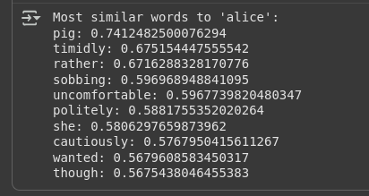
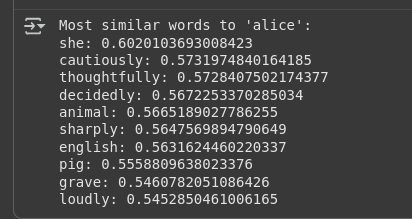
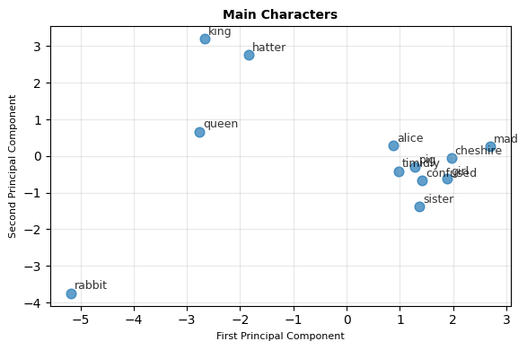
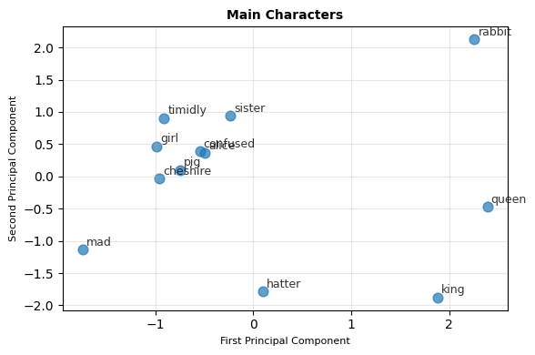
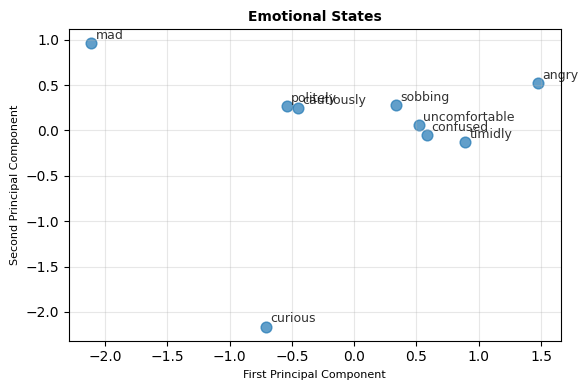
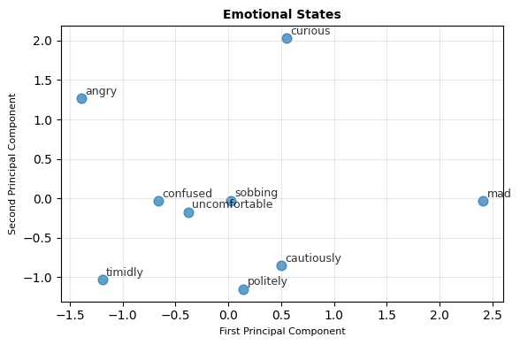
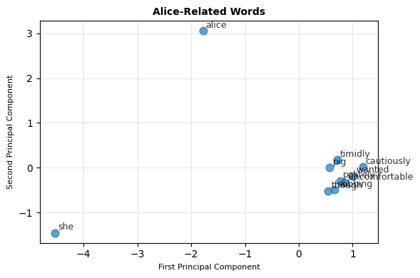
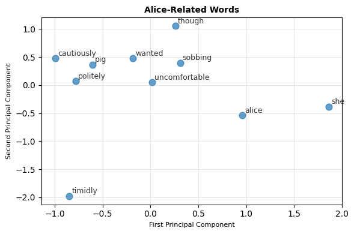
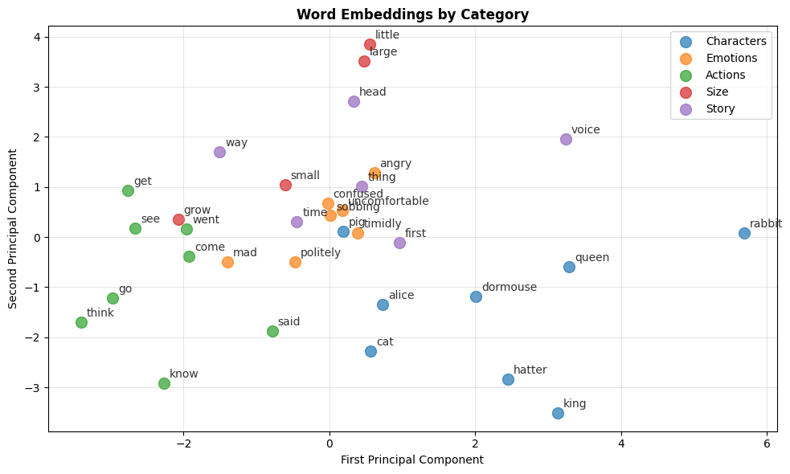
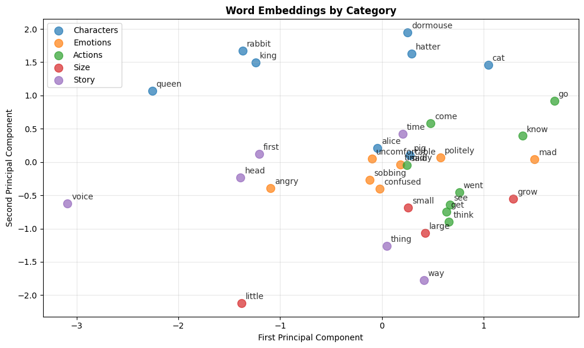

# Word2Vec Implementation and Training from Scratch

## Table of Contents

1. [Introduction](#introduction)
   - 1.1 [Need for Custom Data Training](#need-for-custom-data-training)
   - 1.2 [Neural Network Architecture](#neural-network-architecture)
   - 1.3 [CBOW vs Skip-gram Training](#cbow-vs-skip-gram-training)
2. [Training Objectives](#training-objectives)
   - 2.1 [Key Training Concepts](#key-training-concepts)
3. [Implementation Guide](#implementation-guide)
   - 3.1 [Environment Setup](#environment-setup)
   - 3.2 [Data Collection and Preparation](#data-collection-and-preparation)
   - 3.3 [Data Quality Assessment](#data-quality-assessment)
   - 3.4 [Text Preprocessing Pipeline](#text-preprocessing-pipeline)
   - 3.5 [Training Parameters](#training-parameters)
   - 3.6 [Model Training](#model-training)
   - 3.7 [Model Evaluation](#model-evaluation)
4. [Usage Examples](#usage-examples)
5. [Parameter Guidelines](#parameter-guidelines)
6. [Evaluation Metrics](#evaluation-metrics)

---

## Introduction

### Need for Custom Data Training

While pretrained models like Google News Word2Vec are powerful, training custom models offers several advantages:

| Advantage | Description |
|-----------|-------------|
| **Domain Specificity** | Captures terminology and relationships specific to your field (medical, legal, technical) |
| **Custom Vocabulary** | Includes words and phrases unique to your dataset |
| **Full Control** | Complete control over training parameters and data quality |
| **Privacy** | No need to rely on external models for sensitive data |

### Neural Network Architecture

Word2Vec uses a simple neural network with three layers:

- **Input Layer**: One-hot encoded word vectors
- **Hidden Layer**: Dense representation (the embeddings we want)
- **Output Layer**: Probability distribution over vocabulary

### CBOW vs Skip-gram Training

| Method | Input → Output | Example | Characteristics |
|--------|----------------|---------|-----------------|
| **CBOW** | [Context words] → [Center word] | ["the", "cat", "on", "mat"] → ["sat"] | Faster training, better for frequent words, good for syntactic relationships |
| **Skip-gram** | [Center word] → [Context words] | ["sat"] → ["the", "cat", "on", "mat"] | Slower training, better for rare words, excellent for semantic relationships |

## Training Objectives

The model learns by:
- Maximizing probability of actual word pairs that appear together
- Minimizing probability of random word pairs (negative sampling)
- Adjusting word vectors to achieve these objectives

### Key Training Concepts

#### Context Window
Number of words around target word to consider:
- **Small window (2-3)**: Captures syntactic relationships
- **Large window (5-10)**: Captures semantic/topical relationships

#### Negative Sampling
Instead of computing probabilities for entire vocabulary, sample a few "negative" examples:
- Dramatically speeds up training
- 5-20 negative samples typically used

#### Hierarchical Softmax
Alternative to negative sampling using binary tree structure:
- Better for rare words
- More memory efficient for large vocabularies

## Implementation Guide

### Environment Setup

```bash
# Change working directory (adjust path as needed)
ROOT = "/path/to/your/working/directory"
import os
os.chdir(ROOT)

# Install required packages
pip install gensim nltk numpy scipy scikit-learn
```

### Data Collection and Preparation

```python
# Load your text data
with open('text.txt', 'r', encoding='utf-8') as f:
    texts = f.readlines()

# Check initial data
print(f"Loaded {len(texts)} text documents")
print("Sample texts:", texts[:3])
```


### Data Quality Assessment

The `assess_data_quality()` function provides comprehensive analysis:

| Metric | Description |
|--------|-------------|
| Total Documents | Number of text documents |
| Vocabulary Size | Unique words in corpus |
| Average Sentence Length | Mean words per sentence |
| Vocabulary Diversity | Ratio of unique words to total words |
| Word Frequency Distribution | Most and least common words |

```python
def assess_data_quality(texts):
    stats = {
        'total_documents': len(texts),
        'total_words': 0,
        'unique_words': set(),
        'sentence_lengths': [],
        'word_frequencies': {}
    }

    for text in texts:
        words = text.lower().split()
        stats['total_words'] += len(words)
        stats['sentence_lengths'].append(len(words))
        stats['unique_words'].update(words)

        for word in words:
            stats['word_frequencies'][word] = stats['word_frequencies'].get(word, 0) + 1

    stats['vocabulary_size'] = len(stats['unique_words'])
    stats['avg_sentence_length'] = sum(stats['sentence_lengths']) / len(stats['sentence_lengths'])

    # Find most common words
    sorted_words = sorted(stats['word_frequencies'].items(), key=lambda x: x[1], reverse=True)
    stats['top_words'] = sorted_words[:20]

    # Quality indicators
    stats['quality_score'] = {
        'vocabulary_diversity': stats['vocabulary_size'] / stats['total_words'],
        'avg_word_frequency': stats['total_words'] / stats['vocabulary_size'],
        'rare_words_ratio': sum(1 for count in stats['word_frequencies'].values() if count == 1) / stats['vocabulary_size']
    }

    return stats

# Example usage
quality_report = assess_data_quality(texts)
print(f"Total documents: {quality_report['total_documents']:,}")
print(f"Vocabulary size: {quality_report['vocabulary_size']:,}")
print(f"Unique Words: {quality_report['unique_words']}")
print(f"Average sentence length: {quality_report['avg_sentence_length']:.1f}")
print(f"Vocabulary diversity: {quality_report['quality_score']['vocabulary_diversity']:.4f}")
```


**Quality Indicators:**
- **High vocabulary diversity (>0.1)**: Rich, varied text
- **Balanced word frequencies**: Good mix of common and rare words
- **Appropriate sentence length (5-20 words)**: Well-structured text

### Text Preprocessing Pipeline

The `AdvancedTextPreprocessor` class offers configurable preprocessing:

| Option | Purpose | Recommendation |
|--------|---------|----------------|
| `lowercase` | Convert to lowercase | Always enable |
| `remove_punctuation` | Remove punctuation marks | Generally recommended |
| `remove_numbers` | Remove numeric values | Domain-dependent |
| `remove_stopwords` | Remove common words | Keep for Word2Vec |
| `lemmatize` | Reduce words to root form | Usually not needed |
| `min_word_length` | Filter short words | Depends upon Corpus |

```python
preprocessor = AdvancedTextPreprocessor(
    lowercase=True,
    remove_punctuation=True,
    remove_numbers=True,
    remove_stopwords=False,  # Keep stopwords for Word2Vec
    lemmatize=False,
    keep_sentences=True
)

processed_sentences = preprocessor.preprocess_corpus(texts)
```

### Training Parameters

#### Parameter Selection Guidelines

| Corpus Size | Vector Size | Window | Min Count | Epochs |
|-------------|-------------|--------|-----------|--------|
| < 10K | 50 | 3-5 | 1 | 15 |
| 10K - 100K | 100 | 4-6 | 2 | 10-15 |
| 100K - 1M | 200 | 5-7 | 5 | 10 |
| > 1M | 300 | 5-10 | 10 | 5-10 |

#### Algorithm Selection

| Use Case | Algorithm | Reason |
|----------|-----------|--------|
| Technical/Academic texts | Skip-gram (sg=1) | Better for rare technical terms |
| General text | CBOW (sg=0) | Faster, good for common words |
| Large vocabulary (>100K) | Hierarchical Softmax (hs=1) | Memory efficient |
| Small vocabulary (<100K) | Negative Sampling (negative=10) | Faster training |

### Model Training

#### Training Both CBOW and Skip-gram Models

We'll train two separate models with identical parameters except for the training algorithm to compare their performance and behavior.

```python
# Get parameter recommendations
params = recommend_parameters(
    corpus_size=len(processed_sentences),
    vocab_size=len(vocab),
    domain_type='general',
    computing_resources='moderate'
)

# Common training parameters
common_params = {
    'vector_size': 100,
    'window': 3,
    'min_count': 2,
    'alpha': 0.025,             
    'min_alpha': 0.0001,        
    'hs': 0,
    'epochs': 50,
    'compute_loss': True,
    'negative':10,
    'workers': 4
}

# Train CBOW model (sg=0)
print("Training CBOW model...")
model = train_word2vec_model(
    sentences=processed_sentences,
    save_path='word2vec_model(CBOW).model',
    sg=0,  # CBOW algorithm
    **common_params
)

# Train Skip-gram model (sg=1)
print("Training Skip-gram model...")
model = train_word2vec_model(
    sentences=processed_sentences,
    save_path='word2vec_model(SG).model,
    sg=1,  # Skip-gram algorithm
    **common_params
)
```

### Model Evaluation

#### Evaluation Methods

| Method | Purpose | Metric |
|--------|---------|--------|
| **Word Similarity** | Compare with human judgments | Spearman correlation |
| **Word Analogies** | Test semantic relationships | Accuracy |
| **Vocabulary Coverage** | Test generalization | Coverage ratio |
| **Odd-One-Out** | Test semantic grouping | Accuracy |

## Usage Examples

### Basic Word Similarity Comparison

```python
word = "alice"
if word in model.wv:
    similar_words = model.wv.most_similar(word, topn=10)
    print(f"Most similar words to '{word}':")
    for similar_word, similarity in similar_words:
        print(f"{similar_word}: {similarity}")
else:
    print("Word is not in the vocabulary.")

```
#### Model Comparison Results

| Model Type | Most Similar Words to "alice" |
|------------|-------------------------------|
| **CBOW** |  |
| **Skip-gram** |  |

## Model Visualization and Analysis

### Side-by-Side Model Comparison

```python
from sklearn.decomposition import PCA
import matplotlib.pyplot as plt
import numpy as np

def compare_models_side_by_side(cbow_model, sg_model, words, category_name):
    """Compare CBOW and Skip-gram embeddings side by side"""
    fig, (ax1, ax2) = plt.subplots(1, 2, figsize=(15, 6))
    
    # Function to plot embeddings for one model
    def plot_single_model(model, ax, title):
        vectors = []
        valid_words = []
        for word in words:
            if word in model.wv:
                vectors.append(model.wv[word])
                valid_words.append(word)
        
        if len(vectors) < 2:
            ax.text(0.5, 0.5, f"Not enough words\nFound: {valid_words}", 
                   ha='center', va='center', transform=ax.transAxes)
            return
        
        # Apply PCA
        pca = PCA(n_components=2)
        result = pca.fit_transform(vectors)
        
        # Plot points
        scatter = ax.scatter(result[:, 0], result[:, 1], s=80, alpha=0.7, c='steelblue')
        
        # Add labels
        for i, word in enumerate(valid_words):
            ax.annotate(word, xy=(result[i, 0], result[i, 1]),
                       xytext=(5, 5), textcoords='offset points',
                       fontsize=10, alpha=0.8, fontweight='bold')
        
        ax.set_title(title, fontsize=12, fontweight='bold')
        ax.set_xlabel('First Principal Component', fontsize=10)
        ax.set_ylabel('Second Principal Component', fontsize=10)
        ax.grid(True, alpha=0.3)
        
        # Add explained variance info
        variance_text = f"PC1: {pca.explained_variance_ratio_[0]:.2%}\nPC2: {pca.explained_variance_ratio_[1]:.2%}"
        ax.text(0.02, 0.98, variance_text, transform=ax.transAxes, 
               bbox=dict(boxstyle="round,pad=0.3", facecolor="lightgray", alpha=0.8),
               verticalalignment='top', fontsize=9)
    
    # Plot both models
    plot_single_model(cbow_model, ax1, f"CBOW - {category_name}")
    plot_single_model(sg_model, ax2, f"Skip-gram - {category_name}")
    
    plt.tight_layout()
    plt.show()

# Load both models for comparison
cbow_model = Word2Vec.load('word2vec_model(CBOW).model')
sg_model = Word2Vec.load('word2vec_model(SG).model')

# Compare different word categories
print("=== CBOW vs Skip-gram Comparison ===\n")

# 1. Main Characters Comparison
main_characters = ['alice', 'rabbit', 'queen', 'king', 'cheshire', 'mad', 'hatter', 'pig', 'sister', 'girl']
compare_models_side_by_side(cbow_model, sg_model, main_characters, "Main Characters")

# 2. Emotional States Comparison  
emotional_words = ['timidly', 'politely', 'cautiously', 'sobbing', 'uncomfortable', 'confused', 'curious', 'brave', 'angry', 'mad']
compare_models_side_by_side(cbow_model, sg_model, emotional_words, "Emotional States")

# 3. Alice-Related Words Comparison
alice_related = ['alice', 'pig', 'timidly', 'uncomfortable', 'sobbing', 'politely', 'cautiously', 'though', 'wanted']
compare_models_side_by_side(cbow_model, sg_model, alice_related, "Alice-Related Words")

```

#### Visualization Comparison Results

### CBOW vs Skip-gram Model Comparisons

| Category | CBOW Model | Skip-gram Model |
|----------|------------|-----------------|
| **Main Characters** |  |  |
| **Emotional States** |  |  |
| **Alice-Related Words** |  |  |

### Analysis Notes

| Aspect | CBOW Observations | Skip-gram Observations |
|--------|-------------------|------------------------|
| **Clustering** | Words form loose, spread-out clusters with clear separation between different semantic groups. Character names like 'alice', 'queen', 'king' are well-distributed across the space. | Words form tighter, more compact clusters with closer proximity between semantically related terms. Better grouping of character relationships and emotional states. |
| **Word Proximity** | Greater variance in word positioning with some outliers (e.g., 'rabbit' positioned far from other characters). Emotional words show scattered distribution with moderate clustering. | More consistent word positioning with related words staying closer together. Emotional words like 'timidly', 'politely', 'cautiously' show better proximity and coherent grouping. |
| **Semantic Relationships** | Captures broader semantic categories but with less precise relationships. Good at separating different word types but relationships within categories are less clear. | Demonstrates stronger semantic coherence within categories. Alice-related words show clearer relational patterns, suggesting better capture of contextual usage and semantic similarity. |

### Enhanced Visualization

```python
# Enhanced visualization with different categories
def plot_embeddings_by_category(model, word_categories):
    all_words = []
    all_vectors = []
    labels = []
    colors = []

    color_map = plt.cm.tab10  # Using a color map for different categories

    for i, (category, words) in enumerate(word_categories.items()):
        for word in words:
            if word in model.wv:
                all_words.append(word)
                all_vectors.append(model.wv[word])
                labels.append(category)
                colors.append(color_map(i % 10))  # Cycle through colors

    if len(all_vectors) < 2:
        print("Not enough words for visualization")
        return

    # Apply PCA
    pca = PCA(n_components=2)
    result = pca.fit_transform(all_vectors)

    # Create plot
    plt.figure(figsize=(10, 6))

    # Plot each category with different colors
    for i, category in enumerate(word_categories.keys()):
        indices = [j for j, label in enumerate(labels) if label == category]
        if indices:
            plt.scatter(result[indices, 0], result[indices, 1],
                       color=color_map(i % 10), s=100, alpha=0.7, label=category)

    # Add labels
    for i, word in enumerate(all_words):
        plt.annotate(word, xy=(result[i, 0], result[i, 1]),
                    xytext=(5, 5), textcoords='offset points',
                    fontsize=10, alpha=0.8)

    plt.title('Word Embeddings by Category', fontsize=12, fontweight='bold')
    plt.xlabel('First Principal Component')
    plt.ylabel('Second Principal Component')
    plt.legend()
    plt.grid(True, alpha=0.3)
    plt.tight_layout()
    plt.show()

# Define categories based on your model's vocabulary
word_categories = {
    'Characters': ['alice', 'rabbit', 'queen', 'king', 'hatter', 'dormouse', 'cat', 'pig'],
    'Emotions': ['timidly', 'politely', 'uncomfortable', 'sobbing', 'confused', 'mad', 'angry'],
    'Actions': ['said', 'went', 'think', 'know', 'see', 'go', 'come', 'get'],
    'Size': ['small', 'large', 'little', 'big', 'grow', 'shrink'],
    'Story': ['time', 'way', 'voice', 'head', 'thing', 'first']
}

plot_embeddings_by_category(model, word_categories)
```

### Enhanced Visualization Results

### Model-by-Model Comparison

| Model Type | Word Embeddings by Category |
|------------|----------------------------|
| **CBOW** |  |
| **Skip-gram** |  |


## Parameter Guidelines

### Quick Reference Table

| Parameter | Small Corpus | Medium Corpus | Large Corpus |
|-----------|--------------|---------------|--------------|
| `vector_size` | 50-100 | 100-200 | 200-300 |
| `window` | 3-5 | 5-7 | 5-10 |
| `min_count` | 1-2 | 2-5 | 5-10 |
| `epochs` | 10-20 | 10-15 | 5-10 |
| `workers` | 2-4 | 4-8 | 8+ |

### Advanced Parameters

| Parameter | Default | Purpose | Tuning Tips |
|-----------|---------|---------|-------------|
| `alpha` | 0.025 | Learning rate | Decrease for fine-tuning |
| `min_alpha` | 0.0001 | Final learning rate | Keep low for convergence |
| `negative` | 5 | Negative samples | 5-20 for small vocab |
| `ns_exponent` | 0.75 | Negative sampling distribution | Usually keep default |

## Evaluation Metrics

### Quality Benchmarks

| Metric | Good | Acceptable | Poor |
|--------|------|------------|------|
| **Spearman Correlation** | >0.6 | 0.3-0.6 | <0.3 |
| **Analogy Accuracy** | >50% | 20-50% | <20% |
| **Vocabulary Coverage** | >90% | 70-90% | <70% |


## Key Findings and Insights

After training both CBOW and Skip-gram models, you should observe the following differences:

### Performance Characteristics

| Aspect | CBOW | Skip-gram |
|--------|------|-----------|
| **Training Speed** | Faster | Slower |
| **Memory Usage** | Lower | Higher |
| **Frequent Words** | Better performance | Good performance |
| **Rare Words** | Limited performance | Better performance |
| **Syntactic Tasks** | Strong performance | Good performance |
| **Semantic Tasks** | Good performance | Strong performance |

### Expected Observations

1. **Vocabulary Coverage**: Both models should have similar vocabulary sizes if trained on the same data
2. **Word Similarities**: Skip-gram typically produces more nuanced semantic relationships
3. **Training Loss**: CBOW usually converges faster with lower final loss
4. **Embedding Quality**: Skip-gram often produces better embeddings for semantic tasks

### Visualization Insights

- **PCA Plots**: Show how words cluster in 2D space
- **t-SNE Plots**: Reveal non-linear relationships between words
- **Similarity Comparisons**: Highlight algorithmic differences in word associations

---

## License

This implementation is for educational purposes only.

---

*Last updated: September 2025*
