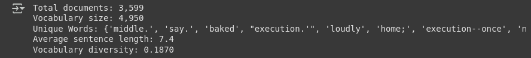
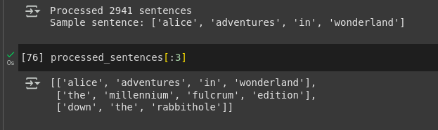
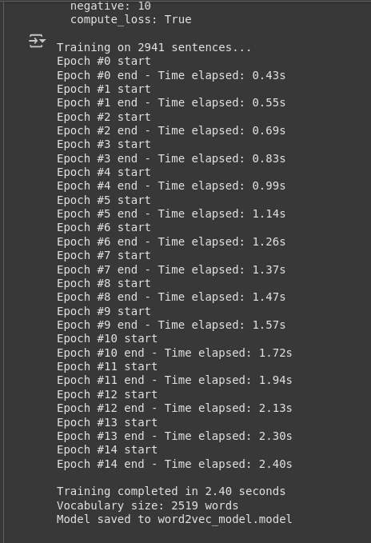
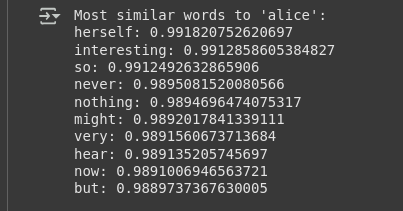

# Word2Vec Implementation and Training from Scratch

## Table of Contents

1. [Introduction](#introduction)
   - 1.1 [Need for Custom Data Training](#need-for-custom-data-training)
   - 1.2 [Neural Network Architecture](#neural-network-architecture)
   - 1.3 [CBOW vs Skip-gram Training](#cbow-vs-skip-gram-training)
2. [Training Objectives](#training-objectives)
   - 2.1 [Key Training Concepts](#key-training-concepts)
3. [Implementation Guide](#implementation-guide)
   - 3.1 [Environment Setup](#environment-setup)
   - 3.2 [Data Collection and Preparation](#data-collection-and-preparation)
   - 3.3 [Data Quality Assessment](#data-quality-assessment)
   - 3.4 [Text Preprocessing Pipeline](#text-preprocessing-pipeline)
   - 3.5 [Training Parameters](#training-parameters)
   - 3.6 [Model Training](#model-training)
   - 3.7 [Model Evaluation](#model-evaluation)
4. [Usage Examples](#usage-examples)
5. [Parameter Guidelines](#parameter-guidelines)
6. [Evaluation Metrics](#evaluation-metrics)

---

## Introduction

### Need for Custom Data Training

While pretrained models like Google News Word2Vec are powerful, training custom models offers several advantages:

| Advantage | Description |
|-----------|-------------|
| **Domain Specificity** | Captures terminology and relationships specific to your field (medical, legal, technical) |
| **Custom Vocabulary** | Includes words and phrases unique to your dataset |
| **Full Control** | Complete control over training parameters and data quality |
| **Privacy** | No need to rely on external models for sensitive data |
| **Learning** | Deep understanding of how Word2Vec actually works |

### Neural Network Architecture

Word2Vec uses a simple neural network with three layers:

- **Input Layer**: One-hot encoded word vectors
- **Hidden Layer**: Dense representation (the embeddings we want)
- **Output Layer**: Probability distribution over vocabulary

### CBOW vs Skip-gram Training

| Method | Input → Output | Example | Characteristics |
|--------|----------------|---------|-----------------|
| **CBOW** | [Context words] → [Center word] | ["the", "cat", "on", "mat"] → ["sat"] | Faster training, better for frequent words, good for syntactic relationships |
| **Skip-gram** | [Center word] → [Context words] | ["sat"] → ["the", "cat", "on", "mat"] | Slower training, better for rare words, excellent for semantic relationships |

## Training Objectives

The model learns by:
- Maximizing probability of actual word pairs that appear together
- Minimizing probability of random word pairs (negative sampling)
- Adjusting word vectors to achieve these objectives

### Key Training Concepts

#### Context Window
Number of words around target word to consider:
- **Small window (2-3)**: Captures syntactic relationships
- **Large window (5-10)**: Captures semantic/topical relationships

#### Negative Sampling
Instead of computing probabilities for entire vocabulary, sample a few "negative" examples:
- Dramatically speeds up training
- 5-20 negative samples typically used

#### Hierarchical Softmax
Alternative to negative sampling using binary tree structure:
- Better for rare words
- More memory efficient for large vocabularies

## Implementation Guide

### Environment Setup

```bash
# Change working directory (adjust path as needed)
ROOT = "/path/to/your/working/directory"
import os
os.chdir(ROOT)

# Install required packages
pip install gensim nltk numpy scipy scikit-learn
```

### Data Collection and Preparation

```python
# Load your text data
with open('text.txt', 'r', encoding='utf-8') as f:
    texts = f.readlines()

# Check initial data
print(f"Loaded {len(texts)} text documents")
print("Sample texts:", texts[:3])
```



### Data Quality Assessment

The `assess_data_quality()` function provides comprehensive analysis:

| Metric | Description |
|--------|-------------|
| Total Documents | Number of text documents |
| Vocabulary Size | Unique words in corpus |
| Average Sentence Length | Mean words per sentence |
| Vocabulary Diversity | Ratio of unique words to total words |
| Word Frequency Distribution | Most and least common words |

```python
def assess_data_quality(texts):
    stats = {
        'total_documents': len(texts),
        'total_words': 0,
        'unique_words': set(),
        'sentence_lengths': [],
        'word_frequencies': {}
    }

    for text in texts:
        words = text.lower().split()
        stats['total_words'] += len(words)
        stats['sentence_lengths'].append(len(words))
        stats['unique_words'].update(words)

        for word in words:
            stats['word_frequencies'][word] = stats['word_frequencies'].get(word, 0) + 1

    stats['vocabulary_size'] = len(stats['unique_words'])
    stats['avg_sentence_length'] = sum(stats['sentence_lengths']) / len(stats['sentence_lengths'])

    # Find most common words
    sorted_words = sorted(stats['word_frequencies'].items(), key=lambda x: x[1], reverse=True)
    stats['top_words'] = sorted_words[:20]

    # Quality indicators
    stats['quality_score'] = {
        'vocabulary_diversity': stats['vocabulary_size'] / stats['total_words'],
        'avg_word_frequency': stats['total_words'] / stats['vocabulary_size'],
        'rare_words_ratio': sum(1 for count in stats['word_frequencies'].values() if count == 1) / stats['vocabulary_size']
    }

    return stats

# Example usage
quality_report = assess_data_quality(texts)
print(f"Total documents: {quality_report['total_documents']:,}")
print(f"Vocabulary size: {quality_report['vocabulary_size']:,}")
print(f"Unique Words: {quality_report['unique_words']}")
print(f"Average sentence length: {quality_report['avg_sentence_length']:.1f}")
print(f"Vocabulary diversity: {quality_report['quality_score']['vocabulary_diversity']:.4f}")
```


**Quality Indicators:**
- **High vocabulary diversity (>0.1)**: Rich, varied text
- **Balanced word frequencies**: Good mix of common and rare words
- **Appropriate sentence length (5-20 words)**: Well-structured text

### Text Preprocessing Pipeline

The `AdvancedTextPreprocessor` class offers configurable preprocessing:

| Option | Purpose | Recommendation |
|--------|---------|----------------|
| `lowercase` | Convert to lowercase | Always enable |
| `remove_punctuation` | Remove punctuation marks | Generally recommended |
| `remove_numbers` | Remove numeric values | Domain-dependent |
| `remove_stopwords` | Remove common words | Keep for Word2Vec |
| `lemmatize` | Reduce words to root form | Usually not needed |
| `min_word_length` | Filter short words | Depends upon Corpus |

```python
preprocessor = AdvancedTextPreprocessor(
    lowercase=True,
    remove_punctuation=True,
    remove_numbers=True,
    remove_stopwords=False,  # Keep stopwords for Word2Vec
    lemmatize=False,
    keep_sentences=True
)

processed_sentences = preprocessor.preprocess_corpus(texts)
```

### Training Parameters

#### Parameter Selection Guidelines

| Corpus Size | Vector Size | Window | Min Count | Epochs |
|-------------|-------------|--------|-----------|--------|
| < 10K | 50 | 3-5 | 1 | 15 |
| 10K - 100K | 100 | 4-6 | 2 | 10-15 |
| 100K - 1M | 200 | 5-7 | 5 | 10 |
| > 1M | 300 | 5-10 | 10 | 5-10 |

#### Algorithm Selection

| Use Case | Algorithm | Reason |
|----------|-----------|--------|
| Technical/Academic texts | Skip-gram (sg=1) | Better for rare technical terms |
| General text | CBOW (sg=0) | Faster, good for common words |
| Large vocabulary (>100K) | Hierarchical Softmax (hs=1) | Memory efficient |
| Small vocabulary (<100K) | Negative Sampling (negative=10) | Faster training |

### Model Training

```python
# Get parameter recommendations
params = recommend_parameters(
    corpus_size=len(processed_sentences),
    vocab_size=len(vocab),
    domain_type='general',
    computing_resources='moderate'
)

# Train the model
model = train_word2vec_model(
    sentences=processed_sentences,
    save_path='word2vec_model.model',
    vector_size=50,
    window=5,
    min_count=1,
    epochs=15,
    compute_loss = True
)
```


### Model Evaluation

#### Evaluation Methods

| Method | Purpose | Metric |
|--------|---------|--------|
| **Word Similarity** | Compare with human judgments | Spearman correlation |
| **Word Analogies** | Test semantic relationships | Accuracy |
| **Vocabulary Coverage** | Test generalization | Coverage ratio |
| **Odd-One-Out** | Test semantic grouping | Accuracy |

```python
evaluator = Word2VecEvaluator(model)

# Evaluate on different tasks
sim_score = evaluator.evaluate_word_similarity(word_pairs)
analogy_score = evaluator.evaluate_analogies(analogy_examples)
coverage = evaluator.analyze_vocabulary_coverage(test_texts)
```

## Usage Examples

### Basic Word Similarity

```python
# Find similar words
word = "alice"
if word in model.wv:
    similar_words = model.wv.most_similar(word, topn=10)
    print(f"Most similar words to '{word}':")
    for similar_word, similarity in similar_words:
        print(f"{similar_word}: {similarity}")
else:
    print("Word is not in the vocabulary.")
```

### Calculate Similarity

```python
similarity = model.wv.similarity('king', 'queen')
print(f"Similarity between 'king' and 'queen': {similarity:.3f}")
```

## Parameter Guidelines

### Quick Reference Table

| Parameter | Small Corpus | Medium Corpus | Large Corpus |
|-----------|--------------|---------------|--------------|
| `vector_size` | 50-100 | 100-200 | 200-300 |
| `window` | 3-5 | 5-7 | 5-10 |
| `min_count` | 1-2 | 2-5 | 5-10 |
| `epochs` | 10-20 | 10-15 | 5-10 |
| `workers` | 2-4 | 4-8 | 8+ |

### Advanced Parameters

| Parameter | Default | Purpose | Tuning Tips |
|-----------|---------|---------|-------------|
| `alpha` | 0.025 | Learning rate | Decrease for fine-tuning |
| `min_alpha` | 0.0001 | Final learning rate | Keep low for convergence |
| `negative` | 5 | Negative samples | 5-20 for small vocab |
| `ns_exponent` | 0.75 | Negative sampling distribution | Usually keep default |

## Evaluation Metrics

### Quality Benchmarks

| Metric | Good | Acceptable | Poor |
|--------|------|------------|------|
| **Spearman Correlation** | >0.6 | 0.3-0.6 | <0.3 |
| **Analogy Accuracy** | >50% | 20-50% | <20% |
| **Vocabulary Coverage** | >90% | 70-90% | <70% |


---

## File Structure

```
project/
├── README.md                 
├── text.txt                 # Your training data
├── word2vec_model.model  # Trained model
```

## Requirements

- Python 3.7+
- gensim
- nltk
- numpy
- scipy
- scikit-learn

## License

This implementation is for educational purposes only.

---

*Last updated: September 2025*
