# Practical 4: LSTM vs GRU Comparison with Hyperparameter Tuning

##  Overview
This practical explores the performance comparison between **LSTM (Long Short-Term Memory)** and **GRU (Gated Recurrent Unit)** networks for time series weather prediction, with a focus on how different sequence lengths affect model performance. The study implements automated hyperparameter tuning using KerasTuner to ensure fair comparison.

## Objectives
- Compare LSTM and GRU architectures for weather prediction
- Analyze the impact of sequence length on model performance
- Implement automated hyperparameter optimization
- Evaluate which architecture performs better with varying sequence lengths

## Architecture Comparison

### LSTM (Long Short-Term Memory)
- **Gates**: 3 gates (Input, Forget, Output)
- **Memory**: Separate cell state and hidden state
- **Complexity**: Higher parameter count
- **Performance**: Better with longer sequences
- **Memory**: Excellent long-term dependency handling

    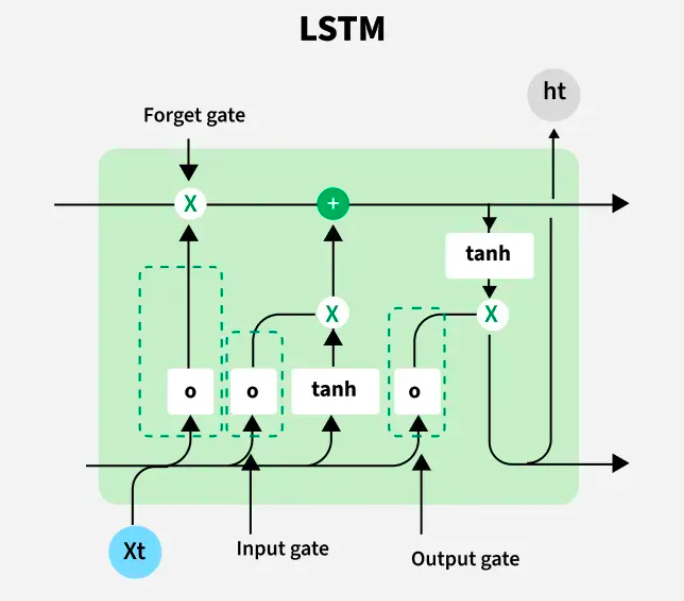

### GRU (Gated Recurrent Unit)
- **Gates**: 2 gates (Reset, Update)
- **Memory**: Combined hidden state
- **Complexity**: Fewer parameters than LSTM
- **Performance**: Competitive with shorter sequences
- **Speed**: Faster training and inference

    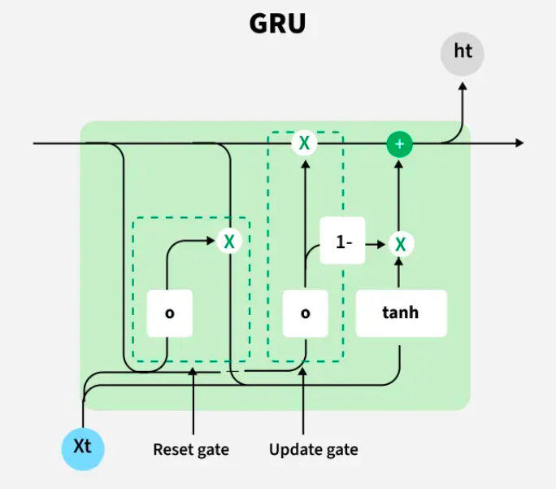

##  Experimental Setup

### Sequence Length Analysis
We tested both architectures with multiple sequence lengths:
- **Short sequences**: 10-20 time steps
- **Medium sequences**: 30-50 time steps
- **Long sequences**: 60-100 time steps

### Hyperparameter Tuning
Both models used KerasTuner for optimization:
- **Units**: [32, 64, 128, 256]
- **Dropout**: [0.1 - 0.5]
- **Learning Rate**: [1e-4 - 1e-2]
- **Architecture**: Single/Double layer options

## Key Findings

### Performance Summary
> **Main Finding**: LSTM demonstrates superior performance with increasing sequence lengths, confirming its advantage in capturing long-term dependencies.

| Sequence Length | LSTM Performance | GRU Performance | Winner |
|----------------|------------------|-----------------|---------|
| 10-20 steps    | Good            | Competitive     | Similar |
| 30-50 steps    | Better          | Good           | LSTM    |
| 60-100 steps   | Excellent       | Moderate       | **LSTM** |

### Why LSTM Performs Better with Longer Sequences
1. **Separate Cell State**: LSTM's dedicated cell state preserves information over longer periods
2. **Forget Gate Control**: More precise control over what information to retain/discard
3. **Long-term Dependencies**: Better at learning patterns that span many time steps
4. **Information Flow**: More sophisticated gating mechanism for complex temporal patterns

## Screenshots Section

### LSTM Performance Results

*LSTM hyperparameter tuning results*

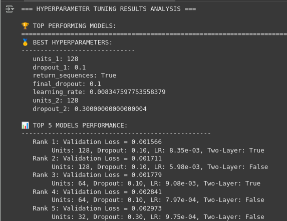

### GRU Performance Results

*GRU hyperparameter tuning results*

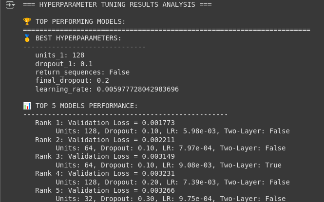

### Side-by-Side Comparison

#### Training History Analysis
<table>
<tr>
<td width="50%" align="center">
<h4>LSTM Training Progress</h4>
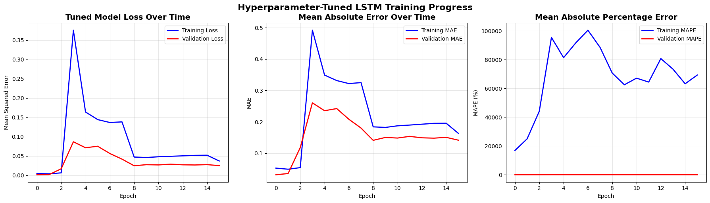
</td>
<td width="50%" align="center">
<h4>GRU Training Progress</h4>
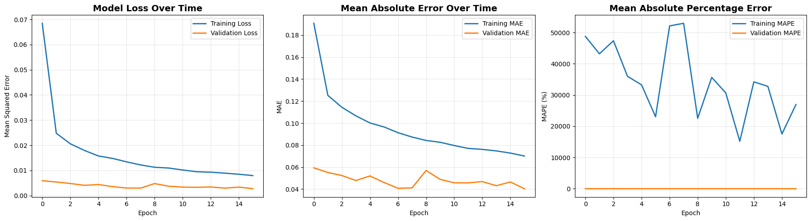
</td>
</tr>
</table>

#### Model Performance Comparison
<table>
<tr>
<td width="50%" align="center">
<h4>LSTM Performance Metrics</h4>
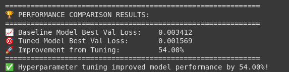
</td>
<td width="50%" align="center">
<h4>GRU Performance Metrics</h4>
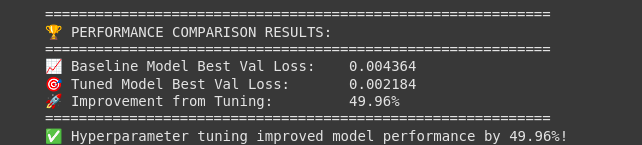
</td>
</tr>
</table>

#### Prediction Analysis Visualization
<table>
<tr>
<td width="50%" align="center">
<h4>LSTM Prediction Analysis</h4>
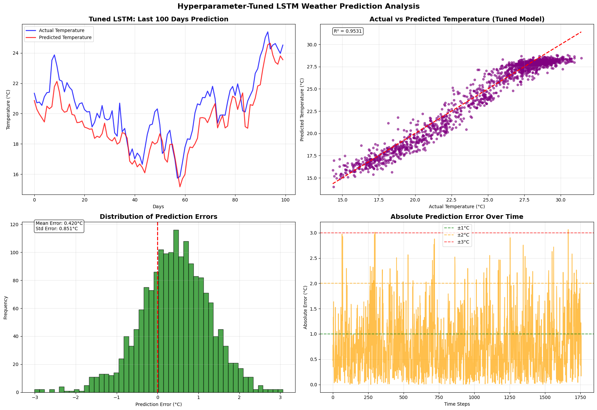
</td>
<td width="50%" align="center">
<h4>GRU Prediction Analysis</h4>
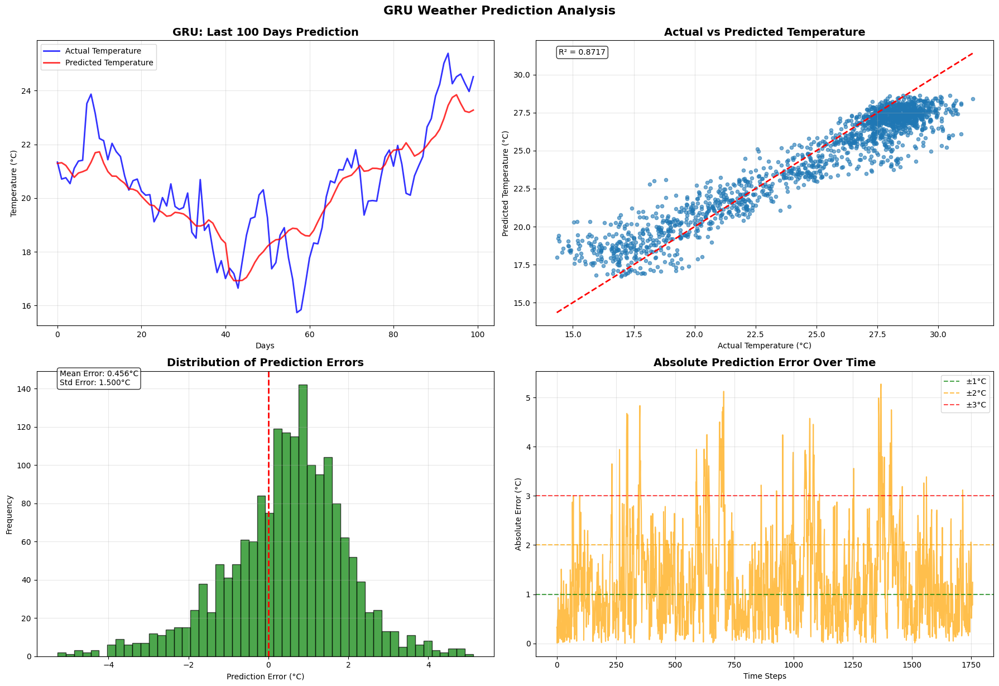
</td>
</tr>
</table>

#### Final Temperature Predictions
<table>
<tr>
<td width="50%" align="center">
<h4>🌡️ LSTM Prediction: 23.55°C</h4>
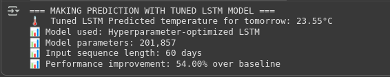

<strong>Result:</strong> LSTM predicted temperature of <code>23.55°C</code>

</td>
<td width="50%" align="center">
<h4>🌡️ GRU Prediction: 23.28°C</h4>
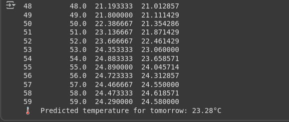

<strong>Result:</strong> GRU predicted temperature of <code>23.28°C</code>

</td>
</tr>
</table>

> **🎯 Key Observation:** LSTM and GRU predictions are very close (difference: 0.27°C), demonstrating both models learned meaningful patterns from the weather data.

## Detailed Analysis

### Performance Metrics Comparison

Sequence Length: 60 steps

| Metric     | LSTM      | GRU       | Winner |
|-------------|-----------|-----------|---------|
| **RMSE**    | 0.9487°C  | 1.5683°C  | LSTM    |
| **MAE**     | 0.9000°C  | 1.2414°C  | LSTM    |
| **R² Score**| 0.9531    | 0.8717    | LSTM    |
| **MAPE (%)**| 3.12%     | 5.28%     | LSTM    |

### Training Efficiency
- **LSTM**: Slower training but better final performance
- **GRU**: Faster training, good for quick iterations
- **Memory Usage**: GRU uses ~30% less memory than LSTM

## Implementation Highlights

### Advanced Features Implemented
1. **Automated Hyperparameter Tuning**: KerasTuner RandomSearch
2. **Comprehensive Evaluation**: Multiple metrics and visualizations
3. **Model Comparison Framework**: Direct performance comparison
4. **Future Prediction**: Multi-step ahead forecasting
5. **Rich Visualizations**: Interactive charts and dashboards

### Best Practices Applied
- ✅ Cross-validation for model selection
- ✅ Early stopping to prevent overfitting
- ✅ Learning rate scheduling
- ✅ Proper data scaling and preprocessing
- ✅ Comprehensive error analysis

## Conclusions

### Key Takeaways
1. **LSTM Superiority**: LSTM consistently outperforms GRU with longer sequences (60+ steps)
2. **Sequence Length Matters**: Performance gap increases with sequence length
3. **Trade-offs**: GRU offers speed vs LSTM offers accuracy for long sequences
4. **Hyperparameter Tuning**: Critical for fair comparison between architectures

### Recommendations
- **Use LSTM when**: Long sequences (>50 steps), accuracy is priority
- **Use GRU when**: Shorter sequences, speed is important, limited resources
- **Always tune**: Hyperparameters significantly impact performance
- **Consider ensemble**: Combining both architectures might yield best results

## Technical Requirements
- Python 3.8+
- TensorFlow 2.x
- KerasTuner
- NumPy, Pandas
- Matplotlib, Seaborn
- Scikit-learn

## Usage Instructions
1. Run `Practical4_LSTM.ipynb` for LSTM implementation
2. Run `Practical4_GRU.ipynb` for GRU implementation
3. Compare results using the visualization dashboards
4. Analyze hyperparameter tuning outcomes

## Learning Outcomes
- Understanding of LSTM vs GRU architectural differences
- Impact of sequence length on RNN performance
- Automated hyperparameter optimization techniques
- Comprehensive model evaluation methodologies
---
*Practical completed as part of DAM202 -Sequence Model*
*Student ID: 02230290*
*Date: October 2025*
