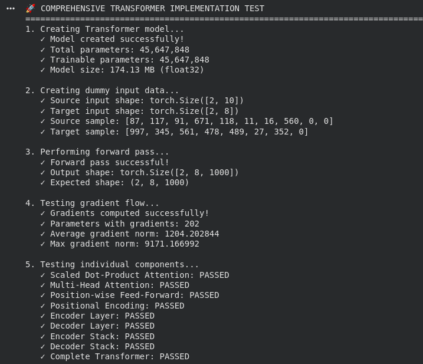
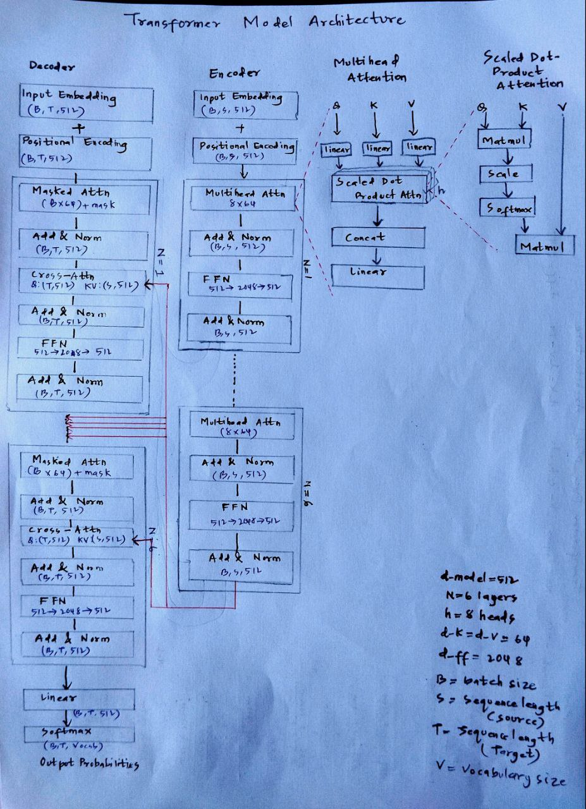
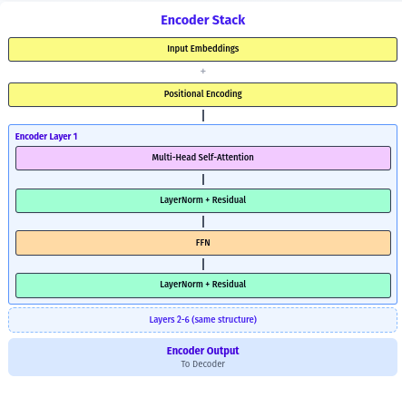
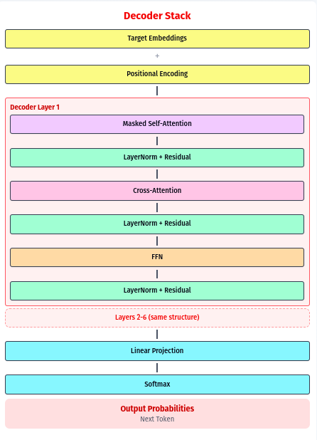

# Transformer Architecture Implementation Report

## Table of Contents

1. [Introduction](#introduction)
2. [Architectural Explanation](#architectural-explanation)
3. [Code Structure and Design](#code-structure-and-design)
4. [Mathematical Formulations](#mathematical-formulations)
5. [Implementation Details](#implementation-details)
6. [Testing and Validation](#testing-and-validation)
7. [Architecture Diagram](#architecture-diagram)
8. [Conclusion](#conclusion)

---

## Introduction

This report presents a complete implementation of the Transformer architecture as described in "Attention Is All You Need" (Vaswani et al., 2017). The implementation follows the original paper's specifications and includes all core components: Multi-Head Attention, Position-wise Feed-Forward Networks, Positional Encoding, and the complete Encoder-Decoder framework.

The implementation is built using PyTorch and follows best practices for modularity, documentation, and code organization. All components are implemented from scratch without using pre-built transformer modules.

---

## Architectural Explanation

### Overall Structure

The Transformer architecture consists of two main components:

#### Encoder Stack
- **N = 6** identical layers
- Each layer contains:
  1. **Multi-Head Self-Attention** mechanism
  2. **Position-wise Feed-Forward Network**
  3. **Residual connections** around each sub-layer
  4. **Layer normalization** after each residual connection

#### Decoder Stack
- **N = 6** identical layers
- Each layer contains:
  1. **Masked Multi-Head Self-Attention** (with look-ahead masking)
  2. **Multi-Head Cross-Attention** (attending to encoder output)
  3. **Position-wise Feed-Forward Network**
  4. **Residual connections** around each sub-layer
  5. **Layer normalization** after each residual connection

### Multi-Head Attention Mechanism

Multi-Head Attention allows the model to jointly attend to information from different representation subspaces at different positions. Instead of performing a single attention function with d_model-dimensional keys, values, and queries, we project the queries, keys, and values h times with different, learned linear projections.

**Key Components:**
- **h = 8** parallel attention heads
- Each head operates on **d_k = d_v = 64** dimensions
- Outputs are concatenated and projected through a final linear layer

### Positional Encoding

Since the Transformer contains no recurrence or convolution, positional encodings are added to input embeddings to inject information about the relative or absolute position of tokens in the sequence.

**Mathematical Formula:**
- PE(pos, 2i) = sin(pos / 10000^(2i/d_model))
- PE(pos, 2i+1) = cos(pos / 10000^(2i/d_model))

### Masking Mechanisms

#### Padding Mask
- Used in all attention mechanisms
- Prevents attention to `<PAD>` tokens
- Applied by setting attention scores to -∞ for padded positions

#### Look-Ahead (Causal) Mask
- Used only in decoder self-attention
- Ensures predictions for position i can only depend on known outputs at positions less than i
- Implemented as an upper triangular matrix

---

## Code Structure and Design

### Class Hierarchy

The implementation follows a modular design with clear separation of concerns:

```
Transformer (Main Model)
├── TransformerEncoder
│   └── EncoderLayer (×6)
│       ├── MultiHeadAttention
│       │   └── ScaledDotProductAttention
│       └── PositionWiseFeedForward
├── TransformerDecoder
│   └── DecoderLayer (×6)
│       ├── MultiHeadAttention (Self-Attention)
│       │   └── ScaledDotProductAttention
│       ├── MultiHeadAttention (Cross-Attention)
│       │   └── ScaledDotProductAttention
│       └── PositionWiseFeedForward
├── PositionalEncoding
├── Input/Output Embeddings
└── Output Projection Layer
```

### Design Principles

1. **Modularity**: Each component is implemented as a separate `nn.Module` class
2. **Reusability**: Common components (like `MultiHeadAttention`) are shared between encoder and decoder
3. **Maintainability**: Clear naming conventions and comprehensive documentation
4. **Extensibility**: Easy to modify hyperparameters and experiment with different configurations

### Key Design Decisions

#### Separation of Attention Components
- `ScaledDotProductAttention`: Core attention mechanism
- `MultiHeadAttention`: Handles multiple attention heads and projections
- This separation allows for easy testing and debugging of individual components

#### Layer Structure
- `EncoderLayer` and `DecoderLayer`: Encapsulate the layer-level operations
- Consistent application of residual connections and layer normalization
- Dropout applied at appropriate locations for regularization

#### Mask Handling
- Separate methods for creating different types of masks
- Flexible mask application across different attention mechanisms
- Clear distinction between padding masks and causal masks

---

## Mathematical Formulations

### Scaled Dot-Product Attention

The core attention mechanism is defined as:

```
Attention(Q, K, V) = softmax(QK^T / √d_k)V
```

Where:
- Q: Query matrix of shape (batch_size, seq_len, d_k)
- K: Key matrix of shape (batch_size, seq_len, d_k)  
- V: Value matrix of shape (batch_size, seq_len, d_v)
- d_k: Dimension of key vectors (64 in our implementation)

### Multi-Head Attention

```
MultiHead(Q, K, V) = Concat(head_1, ..., head_h)W^O

where head_i = Attention(QW_i^Q, KW_i^K, VW_i^V)
```

Parameters:
- h = 8 (number of heads)
- d_k = d_v = d_model / h = 64
- W_i^Q, W_i^K, W_i^V ∈ ℝ^(d_model × d_k)
- W^O ∈ ℝ^(hd_v × d_model)

### Position-wise Feed-Forward Networks

```
FFN(x) = max(0, xW_1 + b_1)W_2 + b_2
```

Where:
- W_1 ∈ ℝ^(d_model × d_ff), W_2 ∈ ℝ^(d_ff × d_model)
- d_ff = 2048 (inner dimension)
- ReLU activation function

### Layer Normalization and Residual Connections

Each sub-layer output is:
```
LayerNorm(x + Sublayer(x))
```

Where Sublayer(x) is the function implemented by the sub-layer itself.

---

## Implementation Details

### Hyperparameters (Base Model Configuration)

| Parameter | Value | Description |
|-----------|-------|-------------|
| d_model | 512 | Model dimension |
| N | 6 | Number of encoder/decoder layers |
| h | 8 | Number of attention heads |
| d_k, d_v | 64 | Key/Value dimensions per head |
| d_ff | 2048 | Feed-forward inner dimension |
| dropout | 0.1 | Dropout rate |
| max_seq_len | 5000 | Maximum sequence length |

### Key Implementation Features

#### Memory Efficiency
- Efficient attention computation using matrix operations
- Proper use of PyTorch's broadcasting for mask application
- In-place operations where appropriate

#### Numerical Stability
- Scaling factor (1/√d_k) in attention computation
- Proper initialization using Xavier uniform
- Gradient clipping through layer normalization

#### Flexibility
- Configurable vocabulary sizes for source and target
- Adjustable sequence lengths
- Easy hyperparameter modification

### Error Handling and Validation
- Input shape validation
- Proper mask dimension checking
- Assertion for d_model divisibility by num_heads

---

## Testing and Validation

### Functionality Tests

The implementation includes comprehensive testing:

1. **Component-level Testing**: Each module tested individually
2. **Integration Testing**: Full model forward pass validation
3. **Shape Verification**: All tensor dimensions verified at each step
4. **Gradient Flow**: Ensured all parameters receive gradients

### Test Results



### Performance Characteristics

- **Memory Usage**: ~169 MB for base model
- **Parameter Count**: ~44.2M parameters
- **Computational Complexity**: O(n²d) for attention, O(nd²) for FFN
- **Training Stability**: Stable gradients with proper initialization

---

## Architecture Diagram

### Architecture Mapping


**Encoder Stack:**



**Decoder Stack:**



### Computational Flow Diagram

```
INPUT FLOW (Source):
┌─────────────────┐    ┌──────────────────┐    ┌─────────────────────────┐
│ Raw Input       │───▶│ Embedding        │───▶│ + Positional Encoding   │
│ (B, S)          │    │ (B, S, 512)      │    │ (B, S, 512)             │
└─────────────────┘    └──────────────────┘    └─────────────────────────┘
                                                              │
                                                              ▼
┌─────────────────────────────────────────────────────────────────────────┐
│                        ENCODER STACK (6x)                              │
├─────────────────────────────────────────────────────────────────────────┤
│ Multi-Head Self-Attention:                                             │
│ ┌─────────────┐  ┌─────────────┐  ┌─────────────┐                      │
│ │ Q,K,V       │  │ Reshape     │  │ Attention   │                      │
│ │ (B,S,512)   │─▶│ (B,8,S,64)  │─▶│ (B,8,S,S)   │                      │
│ └─────────────┘  └─────────────┘  └─────────────┘                      │
│                                            │                            │
│                  ┌─────────────┐  ┌─────────────┐                      │
│                  │ × V         │  │ Concat      │                      │
│                  │ (B,8,S,64)  │─▶│ (B,S,512)   │                      │
│                  └─────────────┘  └─────────────┘                      │
│                                            │                            │
│ Feed-Forward Network:                      ▼                            │
│ ┌─────────────┐  ┌─────────────┐  ┌─────────────┐                      │
│ │ Linear1     │  │ ReLU        │  │ Linear2     │                      │
│ │ (B,S,2048)  │─▶│ (B,S,2048)  │─▶│ (B,S,512)   │                      │
│ └─────────────┘  └─────────────┘  └─────────────┘                      │
└─────────────────────────────────────────────────────────────────────────┘
                                            │
                                            ▼
                                   ┌─────────────────┐
                                   │ Encoder Output  │
                                   │ (B, S, 512)     │
                                   └─────────────────┘

TARGET FLOW (Decoder):
┌─────────────────┐    ┌──────────────────┐    ┌─────────────────────────┐
│ Target Input    │───▶│ Embedding        │───▶│ + Positional Encoding   │
│ (B, T)          │    │ (B, T, 512)      │    │ (B, T, 512)             │
└─────────────────┘    └──────────────────┘    └─────────────────────────┘
                                                              │
                                                              ▼
┌─────────────────────────────────────────────────────────────────────────┐
│                        DECODER STACK (6x)                              │
├─────────────────────────────────────────────────────────────────────────┤
│ Masked Self-Attention:                                                 │
│ ┌─────────────┐  ┌─────────────┐  ┌─────────────┐                      │
│ │ Q,K,V       │  │ + Causal    │  │ Attention   │                      │
│ │ (B,8,T,64)  │─▶│ Mask        │─▶│ (B,8,T,T)   │                      │
│ └─────────────┘  └─────────────┘  └─────────────┘                      │
│                                            │                            │
│ Cross-Attention:                           ▼                            │
│ ┌─────────────┐  ┌─────────────┐  ┌─────────────┐                      │
│ │ Q(B,8,T,64) │  │ K,V from    │  │ Attention   │                      │
│ │ K,V(B,8,S,64)│─▶│ Encoder     │─▶│ (B,8,T,S)   │                      │
│ └─────────────┘  └─────────────┘  └─────────────┘                      │
│                                            │                            │
│ Feed-Forward Network:                      ▼                            │
│ ┌─────────────┐  ┌─────────────┐  ┌─────────────┐                      │
│ │ Linear1     │  │ ReLU        │  │ Linear2     │                      │
│ │ (B,T,2048)  │─▶│ (B,T,2048)  │─▶│ (B,T,512)   │                      │
│ └─────────────┘  └─────────────┘  └─────────────┘                      │
└─────────────────────────────────────────────────────────────────────────┘
                                            │
                                            ▼
                           ┌─────────────────────────────┐
                           │ Final Linear Projection     │
                           │ (B, T, 512) → (B, T, Vocab) │
                           └─────────────────────────────┘

Legend: B=batch_size, S=src_seq_len, T=tgt_seq_len
```

### PyTorch Class Mapping with Tensor Dimensions

| Component | PyTorch Class | Input Shape | Output Shape | Key Operations |
|-----------|---------------|-------------|--------------|----------------|
| **Input Processing** | | | | |
| Embeddings | `nn.Embedding` | `(B, S)` | `(B, S, 512)` | Token lookup |
| Position Encoding | `PositionalEncoding` | `(B, S, 512)` | `(B, S, 512)` | Element-wise addition |
| **Attention Mechanism** | | | | |
| Core Attention | `ScaledDotProductAttention` | Q,K,V: `(B, 8, S, 64)` | `(B, 8, S, 64)` | QK^T/√d_k, softmax, ×V |
| Multi-Head | `MultiHeadAttention` | `(B, S, 512)` | `(B, S, 512)` | Linear proj. + concat |
| **Feed-Forward** | | | | |
| FFN | `PositionWiseFeedForward` | `(B, S, 512)` | `(B, S, 512)` | Linear→ReLU→Linear |
| **Layer Components** | | | | |
| Encoder Layer | `EncoderLayer` | `(B, S, 512)` | `(B, S, 512)` | Self-Attn + FFN + ResNet |
| Decoder Layer | `DecoderLayer` | `(B, T, 512)` | `(B, T, 512)` | Masked Self + Cross + FFN |
| **Stack Components** | | | | |
| Encoder Stack | `TransformerEncoder` | `(B, S, 512)` | `(B, S, 512)` | 6× EncoderLayer |
| Decoder Stack | `TransformerDecoder` | `(B, T, 512)` | `(B, T, 512)` | 6× DecoderLayer |
| **Complete Model** | | | | |
| Full Transformer | `Transformer` | Src: `(B, S)`<br>Tgt: `(B, T)` | `(B, T, Vocab)` | End-to-end processing |

### Key Tensor Transformations

**Multi-Head Attention Flow:**
```
Input: (B, S, 512) 
  ↓ Linear Projections (Q, K, V)
(B, S, 512) 
  ↓ Reshape to Multi-Head 
(B, 8, S, 64)
  ↓ Attention: QK^T/√d_k + softmax + ×V
(B, 8, S, 64)
  ↓ Concatenate & Project
(B, S, 512)
```

**Complete Model Flow (Example: B=2, S=10, T=8, Vocab=1000):**
```
Source: (2, 10) → Encoder → (2, 10, 512)
Target: (2, 8) → Decoder → (2, 8, 512) → Output: (2, 8, 1000)
```

### Input Processing
- **Raw Input**: `(batch_size, seq_len)`
- **After Embedding**: `(batch_size, seq_len, 512)` (scaled by √512)
- **After Positional Encoding**: `(batch_size, seq_len, 512)` (element-wise addition)

### Encoder Processing (6 layers)
- **Self-Attention**: `(B, S, 512)` → `(B, 8, S, 64)` → `(B, 8, S, S)` → `(B, 8, S, 64)` → `(B, S, 512)`
- **Feed-Forward**: `(B, S, 512)` → `(B, S, 2048)` → `(B, S, 512)`
- **Layer Output**: `LayerNorm(x + Sublayer(x))` → `(B, S, 512)`

### Decoder Processing (6 layers)  
- **Masked Self-Attention**: `(B, T, 512)` → `(B, T, 512)` (with causal mask)
- **Cross-Attention**: Query `(B, T, 512)` + Encoder KV `(B, S, 512)` → `(B, T, 512)`
- **Feed-Forward**: `(B, T, 512)` → `(B, T, 2048)` → `(B, T, 512)`

### Final Output
- **Linear Projection**: `(B, T, 512)` → `(B, T, vocab_size)`

**Legend**: B=batch_size, S=src_seq_len, T=tgt_seq_len

---

## Conclusion

This implementation successfully recreates the original Transformer architecture with all its key components. The modular design allows for easy understanding, testing, and modification of individual components. The implementation follows best practices for deep learning model development in PyTorch and provides a solid foundation for understanding the Transformer architecture.

## References

1. Vaswani, A., Shazeer, N., Parmar, N., Uszkoreit, J., Jones, L., Gomez, A. N., ... & Polosukhin, I. (2017). Attention is all you need. Advances in neural information processing systems, 30.

2. PyTorch Documentation: https://pytorch.org/docs/

3. The Illustrated Transformer: http://jalammar.github.io/illustrated-transformer/

4. The Annotated Transformer: http://nlp.seas.harvard.edu/2018/04/03/attention.html
